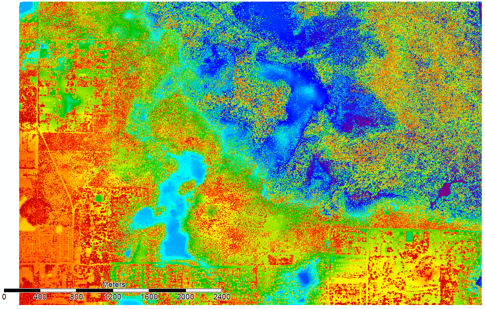
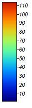

# Establishing Ideal Habitat Locations to Determine Potential Gopher Tortoise (*Gopherus polyphemus*) Protected Areas with LiDAR Data


## Gopher Tortoise Habitat & Protection

Typically, gopher tortoises are found in upland habitats that consist of well-drained sandy soiled areas, you can find them in other habitats such as: scrub, xeric hammock, pine flatwoods, dry prairie, coastal grasslands and dunes, mixed hardwood-pine communities and other disturbed habitats (Auffenberg and Franz 1982; Kushlan and Mazzotti 1984; Diemer 1986, 1987, 1992b; Breininger et al. 1994; Ashton and Ashton 2008). 

A management plan for gopher tortoises was created in 2007 by the Florida Wildlife Commission (FWC) it was revised in 2012 for continued recovery of the Species of Special Concern and this management plan will be re-evaluated in 2022. It is our hope that we can define managed areas for gopher tortoises in the Wekiwa Springs State Park before 2022 when the plan is re-evaluated. 


## How You Can Help!

Help Us! Be a citizen scientist! [FWC](https://mangomap.com/fwcwebmaster/maps/52930/Gopher-Tortoise-Sightings#) has an easy-to-use website that you can upload images of gopher tortoises that you have spotted with the location and they will map it for everyone to view. There have been very few citizen scientists in our study area and we would love your help! If you are enjoying the Wekiwa Springs State Park please feel free to take photos of gopher tortoises and their burrows, but remember, you are in their home and please do not disturb this protected species. Please take only pictures and leave only footprints!


## Our Study Area

This LiDAR dataset is a 17 km2 subset from a 49 km2 total area from Wekiwa Springs State Park obtained from [OpenTopography](http://opentopo.sdsc.edu/lidarDataset?opentopoID=OTLAS.062012.26917.1). There are 112700100 points in the subset. The area is comprised of sandhill and flatwood habitats with some ephemeral swamps. Prescribed fires are often conducted which will clear out excess fuel loads, and provide open ground for new vegetation to propagate. This new vegetation provides palatable forage for many herbivores. The west and south sides are bordering residential areas.
 
Points were classified into low vegetation (points below 0.5 meters but above the ground), medium vegetation (points from 0.5 – 2 meters above the ground), and high vegetation (points between 2-10 meters above the ground). These three classes were then individual isolated into three separate digital elevation models (DEMs), which map the density of these classes. 


## What is LiDAR?

Light detection and ranging (LiDAR) is a remote sensing surveying method which measures the distance from an aerial sensor to the surface of the landscape. Each time an object is registered a point is generated. Each LiDAR dataset may contain millions of points to map the landscape. The landscape is represented by all natural and artificial object and structures, so LiDAR maps the surface of the ground, trees, buildings, etc. Utilizing algorithms, software analyzes the points to classify various terrain types such as the ground surface, low vegetation, medium vegetation, and high vegetation. These different types are represented in a point map as different colors.

## Digital Elevation Models (DEMs)

DEM of all three vegetation classes (low, medium and high vegeation) 



DEM of Low Vegetation- Red is where there is a high amount of low vegetation, whereas blue is where there is a small amount of low vegetation 


DEM of Medium Vegetation- Red is where there is a high amount of medium vegetation, whereas blue is where there is a small amount of medium vegetation 


DEM of High Vegetation- Red is where there is a high amount of high vegation, whereas blue is where there is a small amount of high vegeation. 


## Return Points Per Cell from LiDAR at 5m

Low Vegetation


Legend 

Medium Vegetation


Legend 

High Vegetation


Legend 

All Three Classes (low, medium, high) Together


Legend 

## Return Points Per Cell from LiDAR at 10m 

Low Vegetation


Legend 

Medium Vegetation

Legend 

High Vegetation

Legend 

All Three Classes (low,medium, high) Together

Legend 

## Acknowledgements

OpenTopography Acknowledgment
This material is based on [data, processing] services provided by the OpenTopography Facility with support from the National Science Foundation under NSF Award Numbers 1226353 & 1225810

Data Provider Acknowledgment
OpenTopography hosts datasets that have been collected by many research, governmental, and non-profit organizations funded by a variety of sources. The data user bears sole responsibility for recognizing the role of the data provider through co-authorship, citation, sponsor acknowledgement, and/or attribution, as appropriate and consistent with professional standards and sponsor requirements.
OpenTopography provides dataset acknowledgement language specific to each hosted dataset. This language is composed by the data provider can be found on the dataset access page and through the dataset’s metadata. OpenTopography also provides a Digital Object Identifier (DOI) for each hosted dataset as a means to facilitate data citation. Inclusion of the dataset’s DOI in your data citation or acknowledgement ensures that the dataset can be accessed and reused, data impact can be tracked, and that data producers and collectors are recognized.

## References

Auffenberg, W., and R. Franz. 1982. The status and distribution of the gopher tortoise (Gopherus polyphemus). Pages 95–126 in R. B. &nbsp;&nbsp;&nbsp;&nbsp;&nbsp;&nbsp;Bury, editor. North American tortoises: Conservation and ecology. U.S. Fish and Wildlife Service, Wildlife Research Report 12.

Ashton, R. E., and P. S. Ashton. 2008. The Natural History and Management of the Gopher Tortoise Gopherus polyphemus (Daudin). Krieger &nbsp;&nbsp;&nbsp;&nbsp;&nbsp;&nbsp;Press, Malabar, Florida, USA. 

Breininger, D. R., P. A. Schmalzer, and C. R. Hinkle. 1994. Gopher tortoise (Gopherus polyphemus) densities in coastal scrub and slash &nbsp;&nbsp;&nbsp;&nbsp;&nbsp;&nbsp;pine flatwoods in Florida. Journal of Herpetology 28:60–65.

Diemer, J. E. 1986. The ecology and management of the gopher tortoise in the southeastern United States. Herpetologica 42:125–133.

Diemer, J. E. 1987. The status of the gopher tortoise in Florida. Pages 72-83 in R. Odom, K. Riddleberger, and J. Osier, editors. &nbsp;&nbsp;&nbsp;&nbsp;&nbsp;&nbsp;Proceedings of the Third Southeastern Nongame and Endangered Wildlife Symposium. Georgia Department &nbsp;&nbsp;&nbsp;&nbsp;&nbsp;&nbsp;of Natural Resources, Game and Fish Division, Atlanta, USA.

Diemer, J. E. 1992b. Home range and movements of the tortoise Gopherus polyphemus in northern Florida. Journal of Herpetology 26:158–&nbsp;&nbsp;&nbsp;&nbsp;&nbsp;&nbsp;162.

Kushlan, J. A., and F. J. Mazzotti. 1984. Environmental effects on a coastal population of gopher tortoises. Journal of Herpetology &nbsp;&nbsp;&nbsp;&nbsp;&nbsp;&nbsp;18:231–239.


You can use the [editor on GitHub](https://github.com/brittanyjason/tortoise_mapping/edit/master/README.md) to maintain and preview the content for your website in Markdown files.

Whenever you commit to this repository, GitHub Pages will run [Jekyll](https://jekyllrb.com/) to rebuild the pages in your site, from the content in your Markdown files.

### Markdown

Markdown is a lightweight and easy-to-use syntax for styling your writing. It includes conventions for

```markdown
Syntax highlighted code block

# Header 1
## Header 2
### Header 3

- Bulleted
- List

1. Numbered
2. List

**Bold** and _Italic_ and `Code` text

[Link](url) and 
``'

For more details see [GitHub Flavored Markdown](https://guides.github.com/features/mastering-markdown/).

### Jekyll Themes

Your Pages site will use the layout and styles from the Jekyll theme you have selected in your [repository settings](https://github.com/brittanyjason/tortoise_mapping/settings). The name of this theme is saved in the Jekyll `_config.yml` configuration file.

### Support or Contact

Having trouble with Pages? Check out our [documentation](https://help.github.com/categories/github-pages-basics/) or [contact support](https://github.com/contact) and we’ll help you sort it out.


